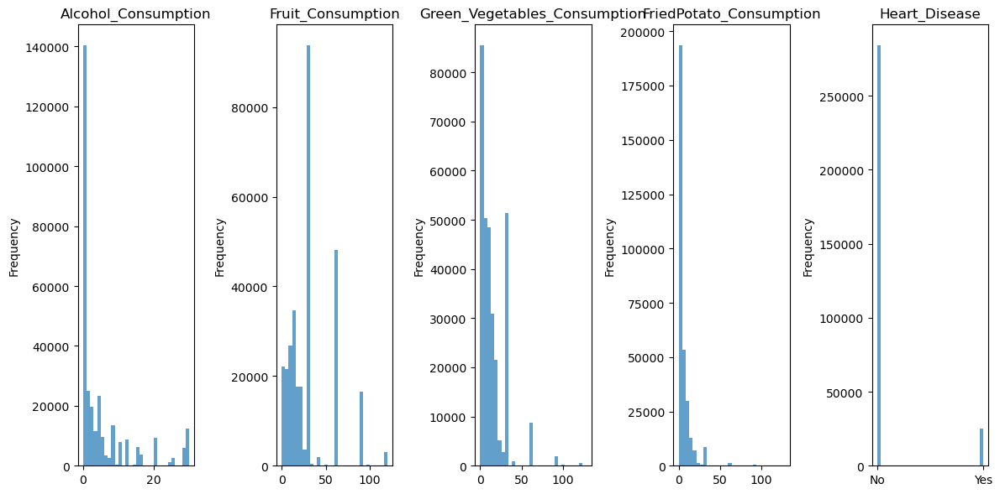

# Cardiovascular_diseases_risk_prediction
Original article: https://eajournals.org/ejcsit/wp-content/uploads/sites/21/2023/06/Integrated-Machine-Learning.pdf

Dataset on Kaggle.com: https://www.kaggle.com/datasets/alphiree/cardiovascular-diseases-risk-prediction-dataset

# Why This Dataset
Eating healthy has long been linked with a reduction in various ailments. With this dataset I was able to explore whether there is statistical significance between heart disease and Alcohol_Consumption, Fruit_Consumption, Green_Vegatable_Consumption, and FriedPotato_Consumption consuming certain foods. The food columns in the data encompass general categories of food, including alcohol, and are not intended to highlight any specific food or diet in particular. My goal is simply to determine if what is consumed has an impact on a person having heart disease.

# The Data
The dataset use contained 308,854 rows with 19 columns. 

There were 80 duplicate row. I chose to leave the duplicates in since many of the columns were yes/no or some type of answer with a limited range. I expected by chance some of the rows would be the same, and they were.

The columns are labeled as:
General_Health, Checkup, Exercise, Heart_Disease, Skin_Cancer, Other_Cancer, Depression, Diabetes, Arthritis, Sex, Age_Category, Height(cm), Weight(kg), BMI, Smoking_History, Alcohol_Consumption, Fruit_Consumption, Green_Vegatable_Consumption, and FriedPotato_Consumption

The columns of interest in this research are: Heart_Disease, Alcohol_Consumption, Fruit_Consumption, Green_Vegatable_Consumption, and FriedPotato_Consumption

This data was originally taken from a much larger dataset with 304 columns. The original source of the data is from the Behavioral Risk Factor Surveillance System (BRFSS) operated by the CDC. The BRFSS is a nationwide telephone survey "that collect state data about U.S. residents regarding their health-related risk behaviors, chronic health conditions, and use of preventive services." From the BRFSS data, the author "hand-picked 19 variables the relates to lifestyle factors of a person that can be contributed to being at risk with any form of Cardiovasular Diseases."

# Hypothesis Test
My hypothesis test is reasonably straght forward:

Null Hypothesis (H0): There is no significant association between the category (alcohol consumption, fruit consumption, green vegetable consumption, fried potato consumption) and the presence of Heart_Disease.

Alternative Hypothesis (Ha): There is a significant association between the category (alcohol consumption, fruit consumption, green vegetable consumption, fried potato consumption) and the presence of Heart_Disease. 

## Testing the Hypothesis
I used the Mann-Whitney U test to check my hypotesis. I checked heart disease yes and no against each of the four columns: alcohol consumption, fruit consumption, green vegetable consumption, fried potato consumption. For the test I used an alpha of 0.05. The results are listed below and are statistically significant with very small P_Values.

                       Category Heart_Disease  Mann_Whitney_U       P_Value
0           Alcohol_Consumption           Yes    3.006144e+09  0.000000e+00
1           Alcohol_Consumption            No    4.082698e+09  0.000000e+00
2             Fruit_Consumption           Yes    3.374578e+09  2.359073e-37
3             Fruit_Consumption            No    3.714265e+09  2.359073e-37
4  Green_Vegetables_Consumption           Yes    3.340435e+09  3.777408e-52
5  Green_Vegetables_Consumption            No    3.748407e+09  3.777408e-52
6       FriedPotato_Consumption           Yes    3.368543e+09  1.863347e-39
7       FriedPotato_Consumption            No    3.720299e+09  1.863347e-39

With these results I rejected my Null Hypothesis and accepted my Alternate Hypthesis.

# Logistic Regression
I chose Logistic regression due to Heart Disease being yes/no (binary) instead of continuous.

## How I changed the data
I started with 12 object columns and 7 float columns. I needed to change the types to something more useful.
-I started by changing the Sex column to binary with yes=1 and no-0. 
-Next, I changed the columns General Health , Diabetes, and Checkup from object to binary columns with get-dummies.
-The Age_Category contained two, two digit ages seperated by a hypen, and the oldest age as 80+.
I used split to remove the hypen and took the mean of the two numbers. To romve the + from 80 and best guess for ages in the survey over 80, I put the highest age as 85.
-This left me with integers and floats I could use.

## The Logistic Regression steps

### Splitting the data
I used the train, test, split to seperate the data into training and seting sets.
I set the test size to 0.2 and the random state to 42.

### Scaling
The X_train was scaled, fitted to the model.
The X_test was scaled only.

### The Regression
I used the Logistic Regression with a random state of 42 using the default threshold of 0.5

### Cross-validation
Cross validation was used with 10 K-Folds to train the testing model. Scoring used the 
Receiver Operating Characteristic - Area Under Curve (roc-auc) to evaluate the models performance.

### ROC-AUC
the roc-auc scores were then averaged

### Prediction
The prediction was then run against the test model

# Results of the Logistic Regression
ROC-AUC scores for each fold:
[0.83581631 0.83996173 0.84231169 0.83711969 0.83089107 0.83413619
 0.83713457 0.8360213  0.82781566 0.82695681]

Average ROC-AUC: 0.83 (±0.00)

ROC-AUC on Testing Data: 0.84

Classification Report on Testing Data:
              precision    recall  f1-score   support

           0       0.92      0.99      0.96     56774
           1       0.50      0.07      0.12      4997

    accuracy                           0.92     61771
   macro avg       0.71      0.53      0.54     61771
weighted avg       0.89      0.92      0.89     61771

## Let's Breakdown the Results
ROC-AUC on Testing Data: 0.84 is the estimate of the model's performance on unseen data or the test set. This model is able to clearly distinguish between Heart Disease = 1 (positive) and Heart Disease = 0 (negative).

### Classification Data
Precision: is the model's ability to correctly predict positives for Heart Disease (= 1) among the true positive cases. This model only predicts 50% of the predicted positives are true positive. Conversely, 92% of predicted negatives are true negatives.

Recall: 0.07 for positive rates indicates this model is only correctly identifying 7% of the actual positive instances.

F1-Score: Is the harmonic mean of precission and recall. This indicates a 12% accuracy for HEart Disease positive cases and a 96% accuracy for negative cases.

Support: This is the number of samples in each class in the testing data. 

Macro Avg: Takes the average for each class without considering the class imbalance.

Weighted Avg: This takes the average for each class weighted by the number of samples in each class.

# Notes about the original research:
Methods used:  
Logistic Regression 
Model, K-Nearest Neighbor, Naive Bayes, Decision Tree Classifier, and Random Forest Classifier

Questions asked:
1) Which machine learning models were utilized to predict the risk of CVDs based on personal lifestyle 
factors?
2) Among the machine learning models used, which model achieved the best F1 score in predicting 
CVD risk?
3) How did hyperparameter tuning improve the performance of the Logistic Regression model in 
predicting CVD risk?
4) Which personal attributes were identified as having the most impact on predicting the risk of CVDs 
according to the Logistic Regression model?
5) What percentage of people with CVDs and healthy individuals were correctly classified by the 
Logistic Regression model?
6) How well did the Logistic Regression model distinguish between classes, as indicated by the AUC 
score?
7) What insights and significant knowledge can be gained from utilizing personal attributes in predicting the risk of CVDs through machine learning approaches?

# Data Colletion for the Dataset used:
A. Data Collection
The data collection procedure for this study involved utilizing the annual BRFSS data in 2021 obtained 
from the Center for Disease Control (2021). The dataset, which consisted of 438,693 records with a total 
of 304 attributes, was accessed on a local machine. However, not all attributes were relevant to this 
particular study. Consequently, a specific subset of 19 attributes was chosen and incorporated into the 
construction of the machine learning (ML) model to create the predictive model for cardiovascular disease 
(CVD). This deliberate selection led to a reduction in the number of records, resulting in a total of 308,854 
data instances utilized for analysis and model development.

# Models used in the original:
To ensure a balanced evaluation of the models, the F1 score was chosen as the metric, which considers 
both precision and recall. Cross-validation was employed using a 10-Stratified K-Fold, and the mean F1 
score was calculated to represent the overall performance of each model. The ML models used in this 
study included Logistic Regression (LR), Gaussian Naive Bayes (NB), Decision Tree Classifier (DT), K-Nearest Neighbor (KNN), and Random Forest (RF)