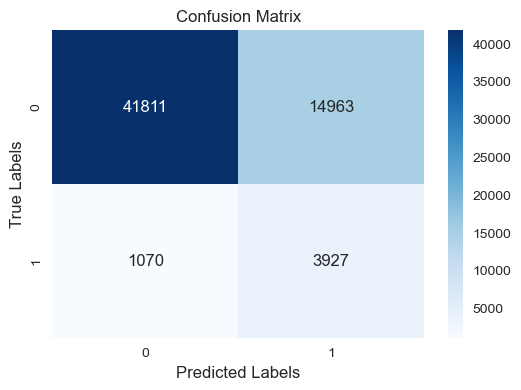
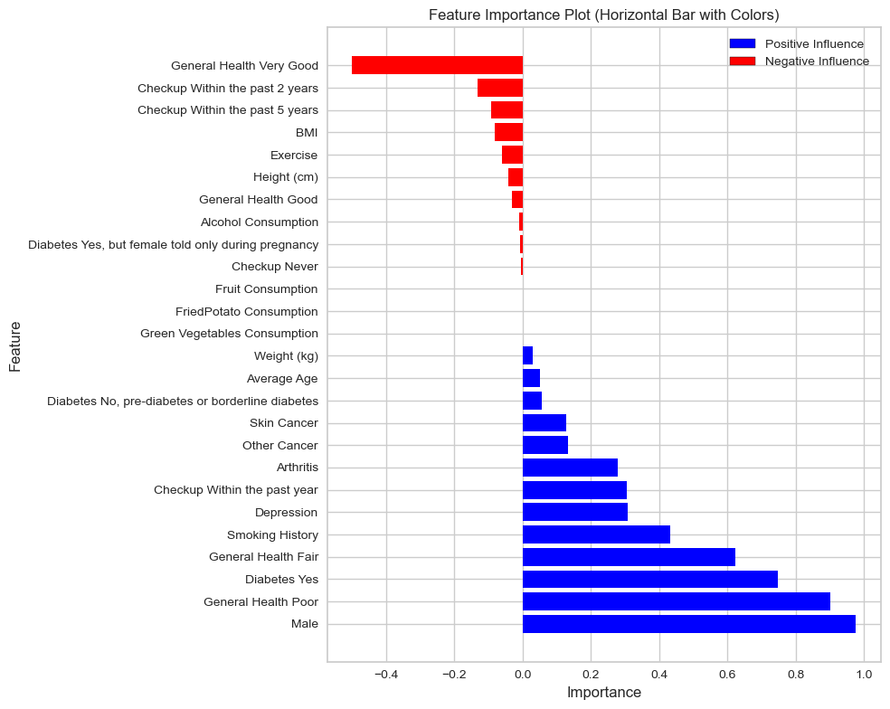

# Cardiovascular_diseases_risk_prediction
Dataset on Kaggle.com: https://www.kaggle.com/datasets/alphiree/cardiovascular-diseases-risk-prediction-dataset

GitHub Repository: https://github.com/bobebend/Cardiovascular_diseases_risk_prediction

# Disclaimer:
This analysis is not intended to provide any medical advice of any kind. It is simply an analysis of this dataset. 

# Why This Dataset
Eating healthy has long been linked with a reduction in various ailments. With this dataset I was able to explore whether there is statistical significance between Heart Disease and Alcohol Consumption, Fruit Consumption, Green Vegatable Consumption, and Fried Potato Consumption consuming certain foods. The food columns in the data encompass general categories of food, including alcohol, and are not intended to highlight any specific food or diet. My goal is simply to determine if what is consumed in this dataset has an impact on a person having heart disease or not.

# The Data
This dataset contained 308,854 rows with 19 columns. 

There were 80 duplicate rows. I chose to leave the duplicates in since many of the columns were yes/no or some type of answer with a limited range. I expected by chance some of the rows would be the same, and a few were.

The columns are labeled as:
General Health, Checkup, Exercise, Heart Disease, Skin Cancer, Other Cancer, Depression, Diabetes, Arthritis, Sex, Age Category, Height(cm), Weight(kg), BMI, Smoking History, Alcohol Consumption, Fruit Consumption, Green Vegatable Consumption, and Fried Potato Consumption.

The columns of interest in this research are: Heart Disease, Alcohol Consumption, FruitConsumption, Green Vegatable Consumption, and Fried Potato Consumption.

Below is a graph of the features of interest.

# Hypothesis Test
My hypothesis test is reasonably straight forward:

Null Hypothesis (H0): There is no significant association between the categories alcohol consumption, fruit consumption, green vegetable consumption, fried potato consumption and the presence of Heart Disease.

Alternative Hypothesis (Ha): There is a significant association between the categories alcohol consumption, fruit consumption, green vegetable consumption, fried potato consumption and the presence of Heart Disease. 

## Testing the Hypothesis
I used the Mann-Whitney U test to check my hypotesis. I checked heart disease yes and no against each of the four columns: alcohol consumption, fruit consumption, green vegetable consumption, fried potato consumption. For the test I used an alpha of 0.05. The results are listed below and show a statistically significant difference between the consumption categories and individuals with and without heart disease. The extemely small P Values indicates strong evidence against the null hypothesis.

                       Category Heart_Disease  Mann_Whitney_U       P_Value
0           Alcohol_Consumption           Yes    3.006144e+09  0.000000e+00
1             Fruit_Consumption           Yes    3.374578e+09  2.359073e-37
2  Green_Vegetables_Consumption           Yes    3.340435e+09  3.777408e-52
3       FriedPotato_Consumption           Yes    3.368543e+09  1.863347e-39

With these results I rejected my Null Hypothesis and accepted my Alternate Hypthesis.

# Logistic Regression
Logistic regression was selected due to Heart Disease being yes/no (binary) instead of continuous.

## How I changed the data
I started with 12 object columns and 7 float columns. I needed to change the types to something more useful. Below are the steps I used in order.

-Changed the Sex column to binary with yes=1 and no-0. 
--I added the columns Male and Female. Next I dropped the Sex column and Female column 

-Changed columns 'Heart_Disease', 'Exercise', 'Skin_Cancer', 'Other_Cancer', 'Depression', 'Arthritis', 'Smoking_History' which were yes/no data to 1=yes and 0=no 

-Changed the columns 'General Health' , 'Diabetes', and 'Checkup' from object to binary columns with get-dummies.

-The Age_Category contained two, two digit ages seperated by a hypen (70-74), and the oldest age as 80+.
I used split to remove the hypens and took the mean of the two numbers. 
--For to 80+ category I replaced it with a best guess average top age of 85 since there is no upper limit to the age category. 

-This left me a dataset which contained integers and floats.

## The Logistic Regression steps

### Splitting the data
I used the train, test, split to seperate the data into training and testing sets.
I set the test size to 0.2 and the random state to 42.

### Scaling
The X_train was scaled, fitted to the model.
The X_test was scaled.

### The Regression
Used logreg regression with class weight balanced to account for the imbalance between the Heart Disease Yes and No columns.

### Cross-validation
Cross validation was used with 10 K-Folds to train the testing model. Scoring used the 
Receiver Operating Characteristic - Area Under Curve (ROC-AUC) to evaluate the models performance.

### ROC-AUC
The ROC-AUC scores were then averaged for each fold and were then run on the testing data.

### Prediction
I set the threshold variable to 0.5 and ran the predictions. I found 0.5 provided the most reasonable results.

# Results of the Logistic Regression
## The Confusion Matrix

                   Predicted Positive    Predicted Negative
Actual Positive         True Positive           False Negative
Actual Negative         False Positive          True Negative

I this case the Confusion Matrix breakdown explaination is as follows:

Upper Left = 41811 (True - Negative) Instances correctly predicting Negative for Heart Disease, indicating a strong ability to identify non-cases.

Upper Right = 14963 (False Positive) Instances predicted as positive for Heart Disease, but were actually negative, are areas where this model may be overly sensitive.

Lower Left = 1070(False Negative) Instances of predicting no Heart Disease, but were actually positive, indicating potential missed cases.

Lower Right = 3927 (True Positive) Instances correctly predicting Positive for Heart Disease

Overall, the model demonstrates high accuracy in correctly identifying non-cases (True Negatives), while it has a higher rate of false positives than true positives. The model's strength lies in minimizing false negatives, which is crucial in medical contexts.

## ROC Curve
The ROC Curve showed that my model was reasonable accurate with a .83 score.

ROC-AUC scores for each fold:
[0.83581631 0.83996173 0.84231169 0.83711969 0.83089107 0.83413619
 0.83713457 0.8360213  0.82781566 0.82695681]

Average ROC-AUC: 0.83 (±0.00)

ROC-AUC on Testing Data: 0.84

Classification Report on Testing Data:
              precision    recall  f1-score   support

           0       0.98      0.74      0.84     56774
           1       0.21      0.79      0.33      4997

    accuracy                           0.74     61771
   macro avg       0.59      0.76      0.58     61771
weighted avg       0.91      0.74      0.80     61771

## Let's Breakdown the Results
ROC-AUC on Testing Data: 0.83 is the estimate of the model's performance on unseen data or the test set. This model is able to clearly distinguish between Heart Disease = 1 (positive) and Heart Disease = 0 (negative).

### Classification Data
#### Precision: 
Precision for class 0 (no Heart Disease) is high at 0.98, indicating that when the model predicts no Heart Disease, it is usually correct.

Precision for class 1 (Heart Disease) is lower at 0.21, suggesting that predictions of Heart Disease are often incorrect.

#### Recall: 
Recall for class 0 is 0.74, indicating that the model captures a substantial proportion of actual no Heart Disease instances.

Recall for class 1 is high at 0.79, highlighting the model's ability to identify a significant portion of actual Heart Disease cases.

#### F1-Score: 
The F1-score for class 1 is relatively low at 0.33, reflecting a trade-off between precision and recall.

The weighted average F1-score is 0.80, indicating a reasonable balance between precision and recall across classes.

Support: This is the number of samples in each class in the testing data. 

Macro Avg: Takes the average for each class without considering the class imbalance.

Weighted Avg: This takes the average for each class weighted by the number of samples in each class.

This model's ROC-AUC scores indicate good discriminatory ability, but its classification report suggests a need for improved precision in predicting Heart Disease. This indicates a potential for further refinement to enhance the model's performance, particularly in correctly identifying cases of Heart Disease.

# Feature Importance Graph:
While there is a statistical significance between the consumption features and those with and without heart disease, they may not be reliable indicators for who will have heart disease solely based on their consumption patterns.

This kind of situation is not uncommon in data analysis. Some variables might show statistical significance in isolation but might not hold strong predictive power when considered in the context of a more complex model. This is why it's important to consider multiple aspects of feature analysis, including statistical tests and predictive model results, to get a better understanding of how different factors contribute to the outcome.

Below, I have a Feature Importance Plot I made based on my linear regression. In the middle of the graph it shows Fruit, Fried Potato and Green Vegetable Consumption as having very little influence as a predictor of Heart Disease. Alcohol Consumption, with it's small red bar, shows it predicts a decreased the risk of Heart Disease slightly.

So what does this mean? Basically, in this data, what you consume in the four categries does not significantly influence if you will get Heart Disease or not as compared to the other categories. For example, other features such as General Poor health, gender, and the presence of diabetes are much stronger indicators of an incresed risk of heart disease. By contrast Very Good General Health and frequent Checkups help lower the risk of Heart Disease and, by extension, early prevention may reduce the risk of Heart Disease as well.

While the four consumable categories may not play a large roll in this data, what you eat does affect categories like BMI or Diabetes which do have more significant importance on this plot.

# Annex:
## Additional graphs
![Histogram_All_Columns]images/Hist_Columns.png

![Correlation_Heatmap]images/Correlation_Heatmap.png

